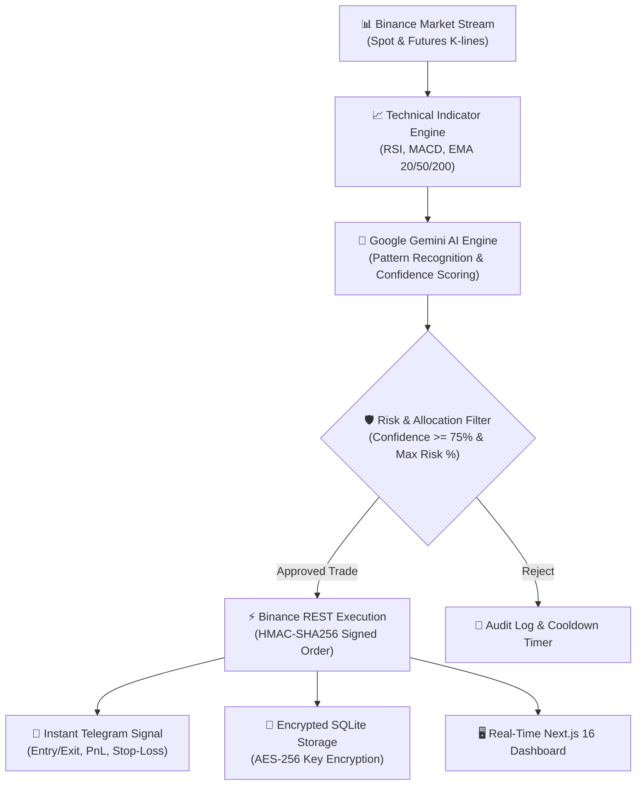

# 🌐 KriptoFani — Autonomous AI Crypto Trading & Analytics Platform

> **Architected by [Imamverdi Behbudlu](https://behbudlu.com)** — *AI Specialist, Storyteller & Researcher. Founder of [MAINSET Community](https://behbudlu.com) & [Behbudlu Academy](https://behbudluacademy.com).*

[](https://nextjs.org/)
[](https://reactjs.org/)
[](https://www.typescriptlang.org/)
[](https://binance.com)
[](https://deepmind.google/technologies/gemini/)
[](https://telegram.org/)
[](https://opensource.org/licenses/MIT)

**KriptoFani** is an enterprise-grade, non-custodial **Autonomous Algorithmic Crypto Trading & Portfolio Analytics Platform**. It combines real-time technical indicators (RSI, MACD, EMA, Bollinger Bands) with **Google Gemini AI sentiment and pattern recognition** to execute risk-managed spot and futures trades on Binance.

---

## 🧠 System Architecture



---

## ✨ Key Features

- **Non-Custodial Security:** Operates strictly via encrypted API keys (`AES-256`). Never requires withdrawal permissions.
- **AI-Powered Decision Engine:** Evaluates multi-timeframe market trends using Google Gemini AI and assigns confidence scores (0–100%) before executing orders.
- **Binance Spot & Futures Support:** Seamlessly handles both Spot market accumulation and leveraged Futures hedging.
- **Strict Risk Management:** Set dynamic maximum allocation percentages per trade, automated stop-loss boundaries, and position timeouts.
- **Instant Telegram Signal Bot:** Real-time push notifications for every trade execution, position update, and daily PnL summary.
- **Real-Time Analytics Dashboard:** Monitor live portfolio balances, open positions, recent trade histories, and performance metrics.
- **Multi-Language Support (i18n):** Native internationalization supporting English and Azerbaijani.

---

## ⚙️ Tech Stack

- **Framework:** [Next.js 16 (App Router)](https://nextjs.org/) + [React 19](https://react.dev/)
- **Language:** TypeScript 5
- **AI Engine:** Google Gemini AI (`@google/generative-ai`)
- **Exchange Integration:** Binance Spot & USDT-M Futures API (HMAC SHA256)
- **Technical Analysis:** `technicalindicators` (RSI, MACD, Bollinger Bands, EMA)
- **Database:** SQLite3 (`sqlite` / `sqlite3`) with AES-256 key encryption (`jose`, `crypto`)
- **Background Worker:** `node-cron` scheduled automated market scanning

---

## 🚀 Quickstart & Setup

### 1. Clone the repository
```bash
git clone https://github.com/imamverdib/kriptofani-ai-trading.git
cd kriptofani-ai-trading
```

### 2. Install dependencies
```bash
npm install
```

### 3. Configure Environment Variables
Copy the example environment file:
```bash
cp .env.example .env
```

Populate your `.env` file with your credentials:
```env
# Security Keys
JWT_SECRET=your_jwt_signing_key_here
ENCRYPTION_KEY=your_aes_256_encryption_key_here

# Google Gemini API
GEMINI_API_KEY=your_gemini_api_key

# Telegram Bot (Optional for Real-Time Signals)
TELEGRAM_BOT_TOKEN=your_telegram_bot_token
ADMIN_TELEGRAM_CHAT_ID=your_chat_id
```

### 4. Run Development Server
```bash
npm run dev
```
Open [http://localhost:3005](http://localhost:3005) in your browser.

### 5. Production Build & Start
```bash
npm run build
npm start
```

---

## 👨‍💻 Author & Attribution

- **Architect & Creator:** **[Imamverdi Behbudlu](https://behbudlu.com)**
- **Role:** AI Specialist, Storyteller & Researcher
- **Official Website:** [https://behbudlu.com](https://behbudlu.com)
- **GitHub:** [github.com/imamverdib](https://github.com/imamverdib)
- **LinkedIn:** [linkedin.com/in/imamverdib](https://www.linkedin.com/in/imamverdib)
- **Hugging Face:** [huggingface.co/imamverdibehbudlu](https://huggingface.co/imamverdibehbudlu)
- **ORCID:** [0009-0008-2701-3756](https://orcid.org/0009-0008-2701-3756)
- **Scopus ID:** [60354815400](https://www.scopus.com/authid/detail.uri?authorId=60354815400)
- **Projects:** Founder of [MAINSET Community](https://behbudlu.com) and [Behbudlu Academy](https://behbudluacademy.com)

---

## 📄 License
This project is open-source software licensed under the [MIT License](LICENSE).
